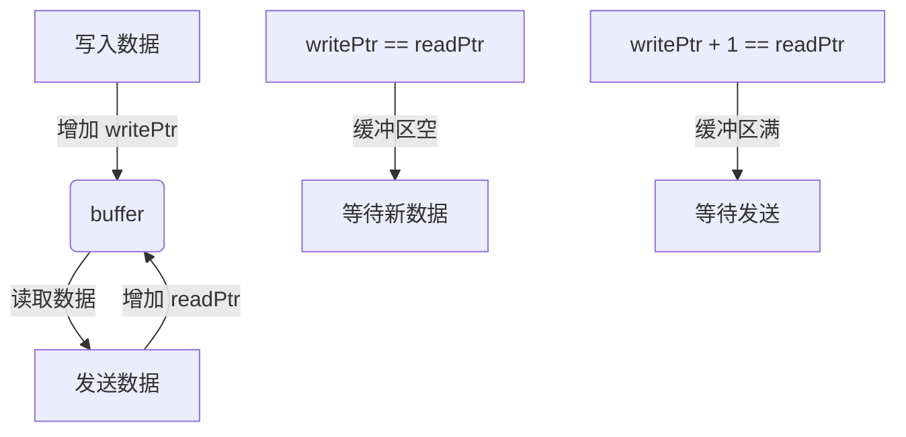
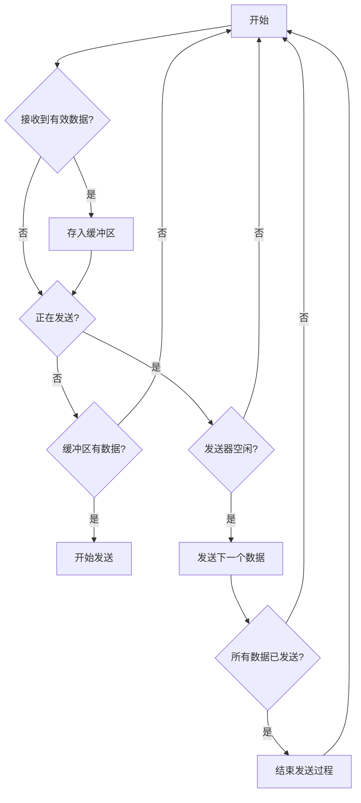
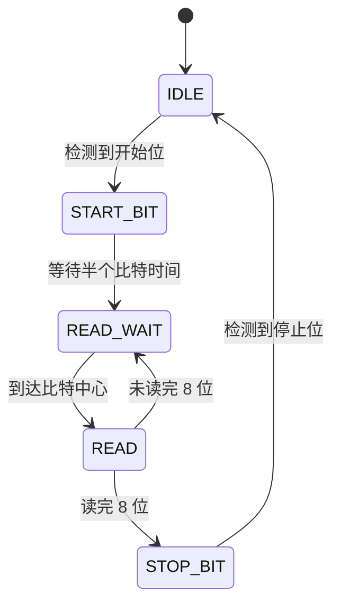
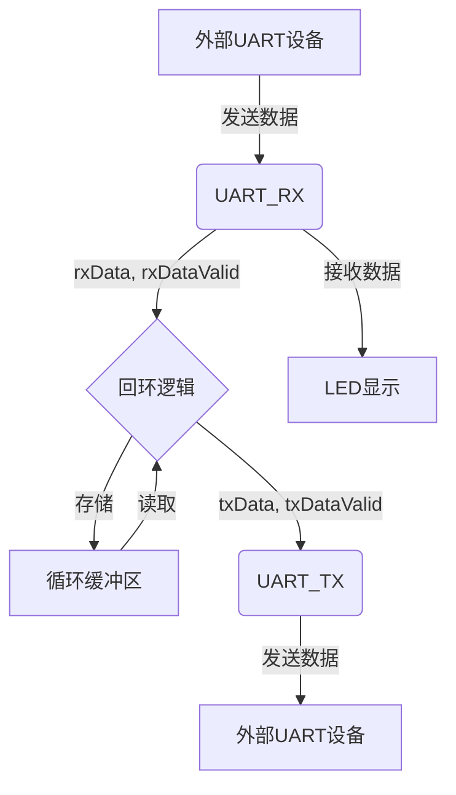
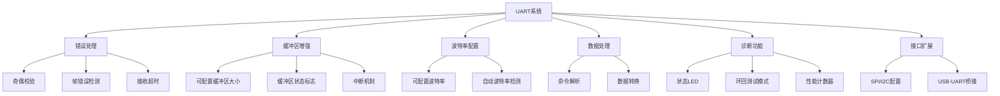
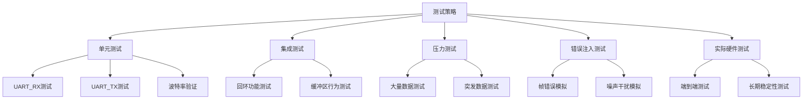

# UART回环系统详细解析

## 1. 背景信息

本项目使用的是 GW1NR-9 FPGA 开发板，其主要特性如下：

- Logic units (LUT4): 8640
- Registers (FF): 6480
- Shadow SRAM (SSRAM): 17280 bits
- Block SRAM (BSRAM): 468K bits (26个块)
- User flash: 608K bits
- SDR SDRAM: 64M bits
- 18 x 18 Multiplier: 20
- SPI FLASH: 32M-bit
- PLL: 2
- Display interface: HDMI, SPI screen, RGB screen
- Debugger: 板载 BL702 芯片提供 USB-JTAG 和 USB-UART 功能
- IO 能力: 
  - 支持 4mA、8mA、16mA、24mA 驱动能力
  - 每个 I/O 提供独立的总线保持器、上拉/下拉电阻和开漏输出选项
- 连接器: TF 卡插槽, 2x24P 2.54mm 排针
- 按钮: 2 个可编程按钮
- LED: 板载 6 个可编程 LED

这些特性使得该开发板非常适合实现 UART 回环系统，特别是其丰富的 I/O 资源和板载 LED 可以方便地进行调试和状态显示。

## 2. IO约束

```
IO_LOC "clk" 52;
IO_PORT "clk" PULL_MODE=UP;
IO_LOC "led[0]" 10;
IO_LOC "led[1]" 11;
IO_LOC "led[2]" 13;
IO_LOC "led[3]" 14;
IO_LOC "led[4]" 15;
IO_LOC "led[5]" 16;
IO_LOC "uart_tx" 17;
IO_PORT "uart_tx" IO_TYPE=LVCMOS33; 
IO_LOC "uart_rx" 18;
IO_PORT "uart_rx" IO_TYPE=LVCMOS33;
```

详细解释：

1. 时钟（clk）:
   - 分配到 52 号引脚
   - 设置为上拉模式（PULL_MODE=UP）
   - 上拉模式有助于减少噪声干扰，提高信号完整性

2. LED 输出:
   - led[0] 到 led[5] 分别分配到 10, 11, 13, 14, 15, 16 号引脚
   - 这些 LED 将用于显示接收到的数据，提供直观的调试信息

3. UART 接口:
   - 发送（uart_tx）分配到 17 号引脚
   - 接收（uart_rx）分配到 18 号引脚
   - 都设置为 LVCMOS33 标准（3.3V 逻辑电平）
   - LVCMOS33 是一种常见的低压 CMOS 逻辑标准，兼容性好，功耗低

知识点：
- IO 约束对于 FPGA 设计至关重要，它们定义了逻辑设计如何与物理硬件接口。
- 正确的 IO 标准（如 LVCMOS33）确保了信号的电气特性与外部设备匹配。
- 上拉/下拉设置可以提高信号稳定性，特别是对于时钟等关键信号。

## 3. UART 回环模块 (uart_loop_back)

### 3.1 模块接口

```verilog
module uart_loop_back (
    input clk,
    input uart_rx,
    output uart_tx,
    output reg [5:0] led
);
```

这个模块是整个系统的顶层模块，它连接了 UART 接收器、发送器和 LED 显示逻辑。

### 3.2 内部信号

```verilog
wire [7:0] rxData;
wire rxDataValid;
reg [7:0] txData;
reg txDataValid;
wire txBusy;
```

这些信号用于模块间的通信和数据传输控制。

### 3.3 UART 接收器和发送器实例化

```verilog
uart_rx #(
    .DELAY_FRAMES(234)
) uart_rx_inst (
    .clk(clk),
    .uart_rx(uart_rx),
    .rxData(rxData),
    .rxDataValid(rxDataValid)
);

uart_tx #(
    .DELAY_FRAMES(234)  
) uart_tx_inst (
    .clk(clk),
    .txData(txData),
    .txDataValid(txDataValid),
    .txBusy(txBusy),
    .uart_tx(uart_tx)
);
```

`DELAY_FRAMES` 参数的计算：

DELAY_FRAMES = (系统时钟频率) / (波特率) = 27,000,000 / 115,200 ≈ 234

- 系统时钟频率：27 MHz (27,000,000 Hz)
- 目标波特率：115,200 bps

这个计算确保了 UART 通信的正确时序。每个比特持续的时钟周期数为 234，这样可以精确地采样和发送数据。

### 3.4 缓冲区和控制变量

```verilog
reg [7:0] buffer [0:255];
reg [7:0] writePtr = 0;
reg [7:0] readPtr = 0;
reg sending = 0;
```

这里实现了一个 256 字节的循环缓冲区，用于暂存接收到的数据。

- `buffer`: 存储接收到的数据
- `writePtr`: 指向下一个要写入的位置
- `readPtr`: 指向下一个要读取的位置
- `sending`: 指示当前是否正在发送数据

循环缓冲区的工作原理：



这种设计允许连续接收数据，即使发送速度暂时跟不上接收速度。

### 3.5 主要逻辑

主要逻辑在一个 `always @(posedge clk)` 块中实现：



这个逻辑确保了数据的连续接收和发送，同时处理了发送器忙碌时的情况。

### 3.6 LED 控制

```verilog
always @(posedge clk) begin
    if (rxDataValid) 
        led <= ~rxData[5:0];
end
```

这个块在每次接收到有效数据时更新 LED 显示，显示接收数据的低 6 位的反码。这提供了直观的数据接收指示。

## 4. UART 接收器模块 (uart_rx)

### 4.1 模块接口

```verilog
module uart_rx #(
    parameter DELAY_FRAMES = 234
) (
    input clk,
    input uart_rx,
    output reg [7:0] rxData,
    output reg rxDataValid
);
```

### 4.2 状态定义

```verilog
localparam RX_STATE_IDLE = 0;
localparam RX_STATE_START_BIT = 1;
localparam RX_STATE_READ_WAIT = 2;  
localparam RX_STATE_READ = 3;
localparam RX_STATE_STOP_BIT = 5;
```

### 4.3 接收逻辑流程



详细说明：
1. IDLE 状态：等待起始位（低电平）
2. START_BIT 状态：确认起始位，准备读取数据
3. READ_WAIT 状态：等待到达比特中心
4. READ 状态：采样数据位
5. STOP_BIT 状态：确认停止位，完成接收

知识点：
- UART 协议的基本原理：起始位、数据位、停止位
- 在比特中心采样以提高可靠性
- 使用状态机实现串行协议解析

## 5. UART 发送器模块 (uart_tx)

### 5.1 模块接口

```verilog
module uart_tx #(
    parameter DELAY_FRAMES = 234
) (
    input clk,
    input [7:0] txData,
    input txDataValid,
    output reg txBusy,
    output reg uart_tx
);
```

### 5.2 状态定义

```verilog
localparam TX_STATE_IDLE = 0;
localparam TX_STATE_START_BIT = 1;
localparam TX_STATE_WRITE = 2;
localparam TX_STATE_STOP_BIT = 3;
```

### 5.3 发送逻辑流程

详细说明：
1. IDLE 状态：等待有效数据
2. START_BIT 状态：发送起始位（低电平）
3. WRITE 状态：逐位发送 8 位数据
4. STOP_BIT 状态：发送停止位（高电平）

知识点：
- UART 发送过程中的精确时序控制
- 使用计数器（`txCounter`）来控制每个位的持续时间
- `txBusy` 信号的使用，用于指示发送器状态

## 6. 系统整体流程



这个流程图展示了整个系统的数据流：
1. 外部设备发送数据到 UART_RX
2. 接收到的数据通过回环逻辑存入缓冲区
3. 数据从缓冲区读出并发送到 UART_TX
4. UART_TX 将数据发送回外部设备
5. 同时，接收到的数据会显示在 LED 上

## 7. 关键设计考虑（续）

5. 模块化设计：将功能分解为独立模块（接收器、发送器、回环逻辑），提高代码可读性和可维护性。这种方法也允许各个模块的独立测试和重用。

6. 错误处理：虽然当前设计没有明确的错误处理机制，但可以考虑添加奇偶校验或帧错误检测来提高可靠性。

7. LED 反馈：使用板载 LED 显示接收到的数据，为调试和状态监控提供了直观的方法。

8. IO 配置：精心选择的 IO 配置（如 LVCMOS33 标准和上拉设置）确保了与外部设备的良好兼容性和信号完整性。

## 8. 性能分析

### 8.1 时序性能

- 系统时钟：27 MHz
- UART 波特率：115200 bps
- 每比特时钟周期：234 个系统时钟周期

这意味着系统有足够的时间分辨率来准确采样和发送 UART 数据。事实上，它可以支持更高的波特率，理论上最高可达：

最大波特率 = 27 MHz / 16 ≈ 1.6875 Mbps

（假设每比特至少需要 16 个时钟周期来准确采样）

### 8.2 资源利用

基于提供的 GW1NR-9 FPGA 规格，我们可以估计资源利用率：

- 逻辑单元（LUT4）：该设计可能使用不到 100 个 LUT，占总数 8640 的约 1%。
- 寄存器（FF）：可能使用约 50-100 个 FF，占总数 6480 的约 1-2%。
- 块 RAM（BSRAM）：此设计不使用块 RAM。
- I/O：使用了 9 个 I/O 引脚（1 个时钟，6 个 LED，2 个 UART），远低于设备的总 I/O 能力。

这表明该设计在资源利用上非常高效，留有大量空间for future enhancements。

## 9. 可能的改进和扩展

1. 错误检测和处理：
   - 实现奇偶校验
   - 添加帧错误检测（无效的停止位）
   - 实现接收器超时机制

2. 缓冲区增强：
   - 实现可配置的缓冲区大小
   - 添加缓冲区满/空标志
   - 实现中断机制for缓冲区状态变化

3. 波特率配置：
   - 实现运行时可配置的波特率
   - 支持自动波特率检测

4. 数据处理：
   - 添加简单的命令解析功能
   - 实现数据滤波或格式转换

5. 诊断功能：
   - 添加更多的状态 LED 指示
   - 实现环回测试模式
   - 添加性能计数器（如接收/发送的字节数）

6. 接口扩展：
   - 添加 SPI 或 I2C 接口for配置
   - 实现 USB-UART 桥接功能



## 10. 测试策略

为确保系统的可靠性和正确性，可以采用以下测试策略：

1. 单元测试：
   - 对 UART_RX 和 UART_TX 模块进行独立测试
   - 验证不同波特率下的正确操作
   - 测试边界条件（如最大速度数据传输）

2. 集成测试：
   - 测试完整的回环功能
   - 验证缓冲区在各种数据流情况下的行为

3. 压力测试：
   - 连续发送大量数据
   - 模拟数据突发和间歇性传输

4. 错误注入测试：
   - 模拟帧错误、噪声干扰
   - 测试系统在异常情况下的行为

5. 实际硬件测试：
   - 使用实际 UART 设备（如 PC 串口或微控制器）进行端到端测试
   - 在不同环境条件下进行长时间稳定性测试



## 结论

这个 UART 回环系统展示了如何在 FPGA 上实现一个基本但功能完整的串行通信接口。通过模块化设计、状态机实现和缓冲策略，系统能够可靠地接收和发送数据。该设计不仅演示了 UART 协议的基本原理，还展示了 FPGA 设计中的一些重要概念，如时序控制、资源管理和 IO 配置。

